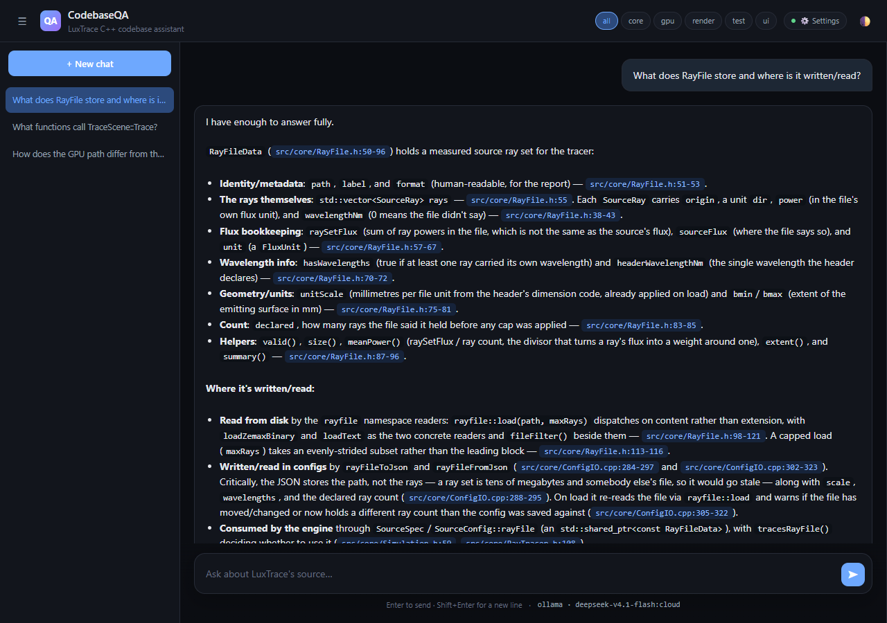
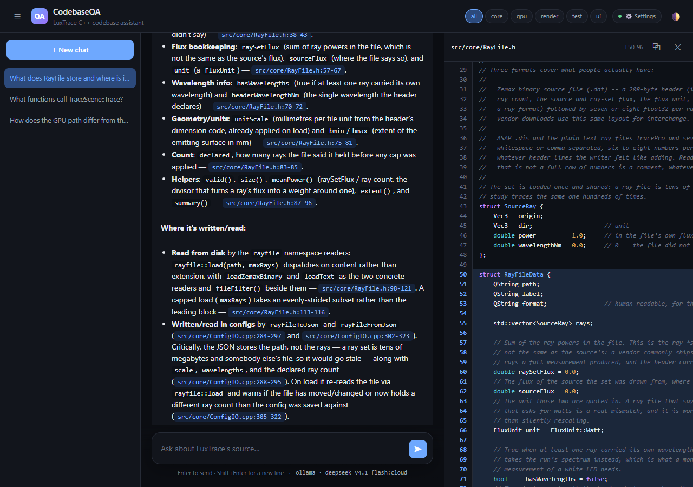
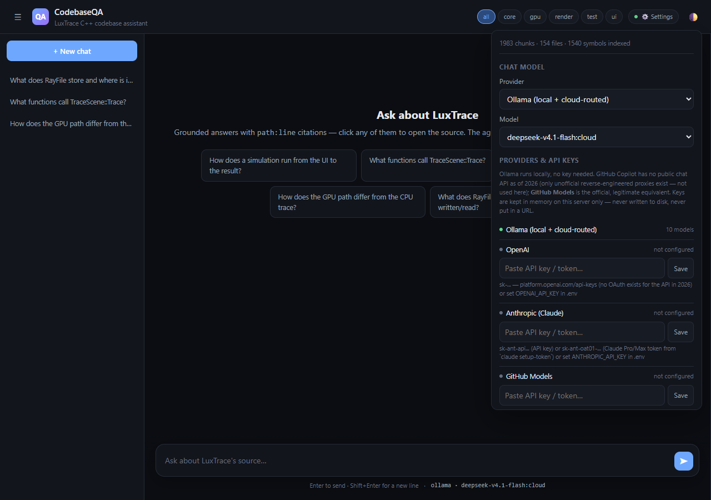
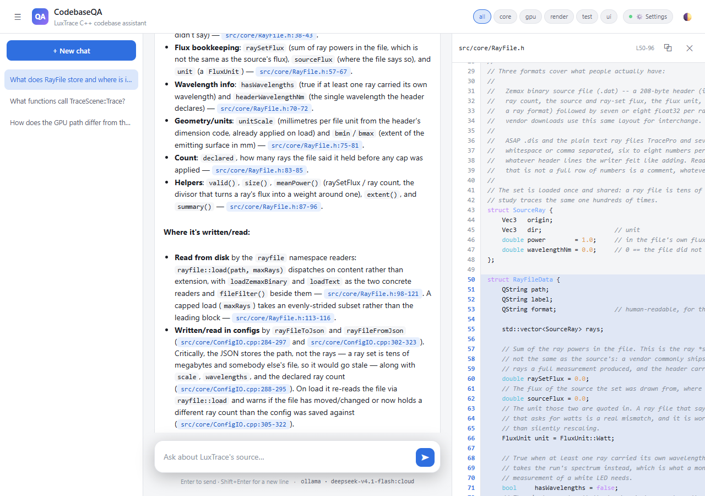

# CodebaseQA

Code-Centric Codebase Q&A Assistant.

Answers natural-language questions about a real C++ codebase (`../LuxTrace`) by combining
AST-aware chunking, hybrid retrieval (BM25 + embeddings), an exact symbol index, and
agentic tool use (`read_file` / `grep` / `search_symbols` / `symbol_usages` / `list_dir`)
when retrieval is thin. Every answer is grounded with `path:line` citations you can click
straight through to the real source. Ships a CLI and a full-featured web chat UI.

**Status: implemented and working end-to-end** against `../LuxTrace` (154 files, 1,983
chunks, 1,540 symbols, 0 skipped). All demo questions pass their acceptance criteria — see
[demo_output.json](demo_output.json) for the full recorded run, and [PLAN.md](PLAN.md) for
the architecture and design decisions in depth.

## Screenshots

**Ask a question, get a grounded answer, click a citation to open the real file:**





**Multi-provider model picker** — Ollama (every local model, auto-listed), OpenAI,
Anthropic, GitHub Models — paste a key or use one already set in `.env`:



**Light theme, same everything:**



## Models (all already installed locally via Ollama)

| Role | Model | Notes |
|---|---|---|
| Chat / agent | `deepseek-v4.1-flash:cloud` | 1M context, native tool calling; cloud-routed, needs Ollama sign-in |
| Embeddings | `qwen3-embedding:4b` | fully local, 2560-dim |
| Offline fallback chat | `qwen3-vl:8b` | set `chat_model` in `config/luxtrace.yaml` |

Additional providers (OpenAI, Anthropic, GitHub Models) are optional and configured from
the web UI's Settings panel or via `.env` — see [Web UI](#web-ui) below.

## Setup

```bash
uv venv .venv
uv pip install -e ".[dev]" --python .venv
```

Requires a running Ollama daemon with `qwen3-embedding:4b` pulled (`ollama pull qwen3-embedding:4b`)
and access to `deepseek-v4.1-flash:cloud` (or edit `config/luxtrace.yaml` to point at a
different chat model, e.g. the local `qwen3-vl:8b`). Copy `.env.example` to `.env` to add
OpenAI/Anthropic/GitHub Models API keys — optional, only needed to use those providers.

## Build the index

```bash
.venv/Scripts/python.exe scripts/index_luxtrace.py
```

Walks `../LuxTrace/src` and `../LuxTrace/test`, AST-chunks every C++/CUDA file via
tree-sitter (with a brace-depth fallback so nothing is ever silently skipped), builds the
exact symbol index and a static **call/include graph** (`.index/graph.json`), asks the chat
model for a one-or-two-sentence **context blurb per chunk** (contextual retrieval — cached in
`.index/context_cache.json`, so rebuilds of unchanged chunks are free), embeds every
`context + chunk`, and writes the Chroma vector store and BM25 index under `.chroma/` /
`.index/`. The first build makes ~2,000 small LLM calls (~9 min on the cloud model); set
`ingest.contextual.enabled: false` in `config/luxtrace.yaml` (or pass nothing and edit the
flag) to skip that and index in ~20 s.

## Ask questions

### CLI
```bash
.venv/Scripts/python.exe -m cqa.cli                     # interactive REPL
.venv/Scripts/python.exe -m cqa.cli --trace "your question here"   # one-shot, with trace
.venv/Scripts/python.exe -m cqa.cli review --base main~3 --head main   # review a git range
.venv/Scripts/python.exe -m cqa.cli review --diff change.patch         # ...or a diff file
.venv/Scripts/python.exe -m cqa.cli tour src/core/ThreadPool.cpp       # onboarding tour (file or module, e.g. `gpu`)
```
Answers stream token-by-token; a one-line metrics footer (latency · tokens · LLM calls · tool
rounds) goes to stderr.

### Web UI

```bash
.venv/Scripts/python.exe -m uvicorn web.server:app --host 127.0.0.1 --port 8000
```
Then open http://localhost:8000.

- **Multi-provider model picker** (Settings → gear icon) — Ollama (every locally installed
  chat model, auto-listed), OpenAI, Anthropic (Claude), and GitHub Models (an
  OpenAI-compatible endpoint, `models.github.ai/inference`). Paste an API key/token right
  in the panel — kept in memory on the server for that session only, never written to disk
  or put in a URL — or set `OPENAI_API_KEY` / `ANTHROPIC_API_KEY` / `GITHUB_TOKEN` in `.env`
  for a persistent default. Anthropic also accepts a Claude Pro/Max subscription token
  (`sk-ant-oat01-...`, from `claude setup-token`) in place of an API key. GitHub Copilot
  itself has no public chat-completions API as of 2026 (only unofficial reverse-engineered
  proxies exist, which this project doesn't use) — GitHub Models is the legitimate
  equivalent.
- **Click any citation to open the source** — a resizable slide-over panel (drag its left
  edge) shows the real file, syntax-highlighted, scrolled to and highlighting the cited
  lines. Works from inline citations, the citation chips under an answer, and the
  retrieved-chunk rows in the trace. The ⧉ button undocks it into a standalone browser
  window/tab for a second monitor.
- **Streaming answers** — text appears as it is generated. If the model calls a tool after
  writing something, that text moves into the trace as "thinking" instead of the answer.
- **Diagrams** — ask for a "call graph / flow / diagram of X": the agent calls the
  `call_graph` tool and the answer embeds the returned Mermaid flowchart (rendered
  client-side, `securityLevel: strict`, light/dark aware; falls back to showing the source).
  Edges are static and name-based, and the tool says so.
- **🔍 Review changes** (sidebar) — pick a git range or paste a unified diff. The server first
  analyses it without an LLM (files, `+/−`, which indexed symbols the changed lines fall in,
  their callers, callers in `test/`, includers of changed headers) and shows that summary; **Run
  review** then reviews it with the selected model in a new thread, with tools and follow-ups.
- **📖 Explain / Tour** — "Explain" in the source-panel header (a file) or the dashed "📖 Tour"
  chip next to the selected module chip (a module) writes an onboarding tour: purpose, key
  types, entry points, flow, reading order, gotchas, tests. Cached per index build, so
  repeating it is instant (and follow-up questions in that thread have the tour as context).
- **Feedback** — 👍 / 👎 under every answer; 👎 opens optional details (what was wrong, the
  correct file). Stored with the turn; export as JSONL from the 📊 modal, or run
  `scripts/feedback_report.py`.
- **Observability** — each answer shows latency · tokens · cost · LLM calls · tool rounds, and
  the trace panel has a per-stage latency timeline. Past turns restore their full trace when
  you reopen a conversation. The 📊 modal aggregates p50/p95 latency, tokens, cost and 👍 rate
  per model. Costs come from `config/pricing.yaml` (empty for hosted models until you fill it
  in — nothing is guessed; local Ollama shows "local").
- **Light / dark / system theme toggle**, persisted.
- **Conversation sidebar** — multiple threads, rename, delete, durably persisted
  (SQLite-backed `SqliteSaver`, survives a server restart) and restorable.
- **Module filter** — scope retrieval to `core`/`gpu`/`render`/`ui`/`test`.
- Live retrieve → reason → tools trace panel per answer, with (mostly) less boring status
  text while tools are running.
- Deep-linkable: `/?thread=<id>` restores a conversation, `&source=path:start-end` also
  opens the source panel, `&theme=light|dark` and `&settings=1` — handy for sharing a
  specific answer or scripting a demo.

**Run the demo questions** from PLAN.md §7 and record output to `demo_output.json`:
```bash
.venv/Scripts/python.exe scripts/demo_questions.py
```

**Tests** (41, no real LLM — PLAN.md §8.1; the graph tests use a scripted fake provider, and
need the built index plus local Ollama for embeddings):
```bash
.venv/Scripts/python.exe -m pytest tests/ -v
```
They cover: the confidence gate under rerank / multi-query / expansion, per-turn trace reset,
forced tool use on thin retrieval, follow-up rewriting, parallel sub-question merge, review
diff → symbol mapping, git-tool path/ref safety, provider stream reassembly, and the turn/feedback
store.

**Retrieval benchmark** — recall@k / MRR for each retrieval toggle over 25 hand-labeled
questions (`eval/bench_cases.yaml`):
```bash
.venv/Scripts/python.exe scripts/retrieval_bench.py -v
```

**Answer-level eval harness** — runs the FULL agent over golden questions
(`eval/answer_cases.yaml`) and scores the final answer (not just chunk recall): grounding / citation
validity, refusal on out-of-scope questions, latency budget, tokens & cost, plus retrieval recall
from the turn trace. Per-category and aggregate report; `--gate` enforces `eval/gates.yaml` and
exits non-zero on a miss (CI gate).
```bash
.venv/Scripts/python.exe scripts/eval_answers.py              # all cases
.venv/Scripts/python.exe scripts/eval_answers.py --limit 8    # small/quick
.venv/Scripts/python.exe scripts/eval_answers.py --ids def-coating neg-login
.venv/Scripts/python.exe scripts/eval_answers.py --gate       # enforce thresholds
.venv/Scripts/python.exe -m pytest tests/test_evalutil.py -q   # scoring helpers
```

## Retrieval quality — what was measured

`scripts/retrieval_bench.py`, 25 hand-labeled LuxTrace questions (21 single-topic, 2 needing a
one-call-away neighbor, 2 follow-ups). A case "hits" when any expected file is among the
returned chunks. **Small sample — one case is 4 points; treat differences under ~0.05 as noise.**

| Configuration | recall@1 | recall@3 | recall@8 | MRR | +latency |
|---|---|---|---|---|---|
| Plain index, hybrid BM25+dense (original) | 0.32 | 0.60 | 0.92 | 0.51 | — |
| Plain + query analysis | 0.48 | 0.76 | 1.00 | 0.65 | +0.8 s |
| Plain + rerank (fused) | 0.48 | 0.76 | 0.96 | 0.63 | +1.0 s |
| Plain + rerank (fused) + analysis | 0.52 | 0.84 | 1.00 | 0.70 | +1.8 s |
| **Contextual index (shipped default)** | 0.76 | 0.84 | 0.92 | 0.82 | — |
| **Contextual + query analysis (shipped default)** | **0.80** | **0.92** | 0.96 | **0.86** | +0.8 s |
| Contextual + rerank (pure) | 0.52 | 0.76 | 0.96 | 0.67 | +1.0 s |
| Contextual + rerank (fused) | 0.64 | 0.76 | 0.92 | 0.73 | +0.9 s |
| Contextual + rerank (fused) + analysis | 0.76 | 0.92 | 1.00 | 0.85 | +1.7 s |
| Contextual + call-graph expansion | 0.76 | 0.84 | 0.92 | 0.82 | +0.01 s |

Caveats on the numbers: rows using query analysis vary run to run (an LLM writes the
rewrite — the same config scored MRR 0.59 and 0.65 in two runs), and the "Plain index" rows were
measured with `candidate_k: 30` before the pool was tuned to 20 (same recall on the bench, ~40%
faster). Latencies are per question on this machine.

What that says, honestly:

- **Contextual chunk embeddings are the big win** (MRR 0.51 → 0.82). It is a one-time index cost.
- **Query analysis helps on top of it** (recall@8 up, follow-ups recover their topic) for ~0.8 s.
- **The cross-encoder reranker helps a plain index but *hurts* the contextual one** (it reads the
  bare chunk, while the index already ranks on the enriched text). It stays available
  (`retrieval.rerank.enabled`) and is worth turning on if you index without contextual chunks
  or want the extra recall@8 at the price of ~1 s; it is **off** by default.
- **Call-graph expansion shows no gain here** — the bench has no question that needs it, and I
  didn't hand-pick cases the graph would trivially satisfy (that would be circular). It is off
  by default; it is still exercised by tests, and the `call_graph` tool, diagrams, review and
  tours all use the same graph regardless.
- The graph is **static and name-based**: no type resolution, names with more than 3
  definitions are skipped, so e.g. callers of `Simulation::run` (called via `obj.run()`) are
  missing. The tool output says so and points to `symbol_usages` for ground truth.

Reranker note: the default model is `jinaai/jina-reranker-v1-turbo-en` (~0.15 GB, 8K context);
`BAAI/bge-reranker-base` is ~1 GB, so it is not the default.

## Sample Q&A (recorded, see `demo_output.json` for the full run)

> **Q: What functions call `TraceScene::Trace`?**
>
> There is no `TraceScene::Trace` symbol in this codebase — `TraceScene`
> (`src/core/TraceScene.h:138-210`) exposes `build`, `clear`, `nearestHit`, `occluded`,
> etc., but no trace method. The function you likely mean is `RayTracer::trace`, which
> takes a `const TraceScene&`. Its callers include `Simulation::run`
> (`src/core/Simulation.cpp:494`), `Studies.cpp:1057/1103/1141/1312`, and the CLI harness
> (`src/main.cpp:197`)...

This is the agent correctly refusing to hallucinate a symbol that doesn't exist, resolving
via `search_symbols`/`grep` tool calls (retrieval alone was flagged "thin" — see
PLAN.md §3.1), and citing the real entry point instead. 3 tool rounds, ~4s.

## How it works

See [PLAN.md](PLAN.md) §3 for the full architecture, and [HANDOVER.md](HANDOVER.md) for a
detailed writeup of the design decisions and how to adapt this to a different (larger,
multi-repo, multi-language) target. In short:

```
question → ANALYZE   (one small LLM call: standalone rewrite of follow-ups, extra queries,
                      HyDE passage, and — for compound questions — a sub-question plan)
         → RETRIEVE  (hybrid BM25+dense over context-enriched chunks, RRF merge, exact symbol
                      lookup; optional rerank / call-graph expansion) ┐ compound questions fan
           SUB_RETRIEVE × N  (parallel, one per sub-question)      ┘ out here and re-join
         → REASON    (LLM decides: answer, or call a tool; streams the answer text)
         → [TOOLS: read_file / grep / search_symbols / symbol_usages / list_dir /
                   call_graph / git_log / git_blame]*  (≤3 rounds; ≤5 in review/tour mode)
         → ANSWER    (grounded, path:line citations)
```

Review and tour are the **same graph** in `mode="review"` / `mode="tour"`: a deterministic
step (`cqa/review.py`, `cqa/onboard.py`) builds the evidence block (diff + impact analysis, or a
file/module skeleton) instead of a similarity search, so tools, checkpointed follow-ups,
citations, tracing, feedback and metrics all work unchanged.

Retrieval that's "thin" (few/weak hits, or a named symbol the exact index couldn't
resolve) hard-forces at least one tool call on the first round, so the demo can prove
tool use happens rather than depending on model whim (PLAN.md §3.1). That gate is
computed from the *original question's* own RRF scores over the whole candidate pool — never
from a reranked or expanded list, and a symbol name the query rewriter invented can't
trigger it (both covered by tests). Follow-up questions
reuse the same LangGraph thread (durable `SqliteSaver` checkpointing) so "and what calls
that?" carries prior context — and survives a server restart.

**Why not just paste the repo into the prompt?** Measured on this exact project: the full
indexed source is ~690,000 tokens; a real question answered through this pipeline costs
~8,000–13,000 tokens — roughly 50–85x less, with better accuracy (no "lost in the middle")
and near-instant latency instead of a multi-second prefill. See HANDOVER.md §2 for the
full numbers and methodology.
